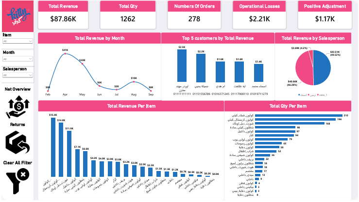
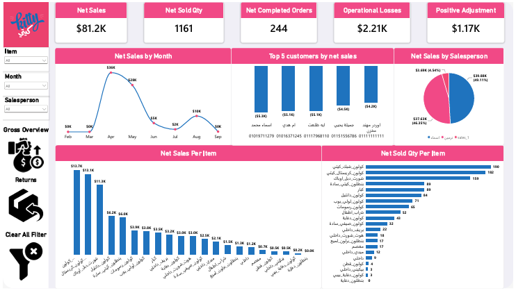
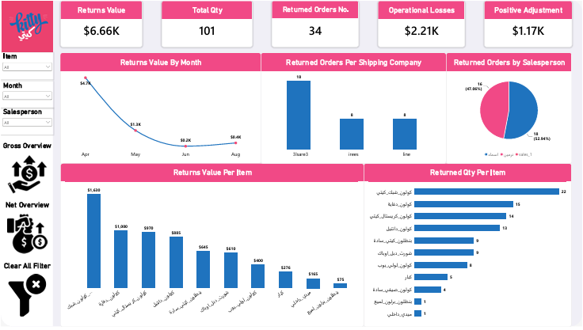

# Kitty Dashboard (كيتي) 🐱

A Power BI dashboard project for **Kitty**, a kids' clothing retail brand, built to track sales performance across **Gross**, **Net**, and **Returns** views — with supporting logistics losses and positive adjustments.

---

## 📊 Project Overview

The report analyzes order-level retail data (raw sales sheets from multiple shipping/fulfillment companies) and transforms it into a clean, query-ready star-schema model. The dashboard answers questions like:

- What's our total (gross) revenue vs. our net revenue after returns?
- Which items, salespeople, and customers drive the most sales?
- What's the value and volume of returned orders, and why?
- How much are we losing to logistics issues, and gaining from positive adjustments?

---

## 🗂️ Dashboard Pages

The report has 4 pages, navigable from the left-hand menu (or buttons on the Home Page). All analytical pages share **Item**, **Month**, and **Salesperson** slicers, plus a **Clear All Filter** button.

### 1️⃣ Home Page
Cover/landing page with the Kitty logo and navigation buttons to the 3 analytical pages.

### 2️⃣ Gross Overview
Sales performance **before** deducting returns — i.e., everything sold, regardless of what came back later.
- **KPI cards:** Total Revenue ($87.86K), Total Qty (1,262), Number of Orders (278), Operational Losses ($2.21K), Positive Adjustment ($1.17K)
- **Total Revenue by Month** (line chart) — Feb–Sep trend, peaking at $41K in April
- **Top 5 Customers by Total Revenue** (bar chart)
- **Total Revenue by Salesperson** (pie chart) — split across 3 salespeople (اسماء, نرمين, sales_1)
- **Total Revenue Per Item** (bar chart) — best-selling items by revenue
- **Total Qty Per Item** (bar chart) — best-selling items by quantity

### 3️⃣ Net Overview
Sales performance **after** deducting returns — the true, realized business result.
- **KPI cards:** Net Sales ($81.2K), Net Sold Qty (1,161), Net Completed Orders (244), Operational Losses ($2.21K), Positive Adjustment ($1.17K)
- Same visual layout as Gross Overview (Net Sales by Month, Top 5 Customers by Net Sales, Net Sales by Salesperson, Net Sales Per Item, Net Sold Qty Per Item) — but recalculated after removing returned orders
- Comparing Gross vs. Net side-by-side shows the actual cost of returns: **$87.86K → $81.2K** (~7.5% shrinkage)

### 4️⃣ Returns
A dedicated breakdown of everything that came back.
- **KPI cards:** Returns Value ($6.66K), Total Qty (101), Returned Orders No. (34), Operational Losses ($2.21K), Positive Adjustment ($1.17K)
- **Returns Value by Month** (line chart) — heavily front-loaded in April ($4.7K), tapering off after
- **Returned Orders Per Shipping Company** (bar chart) — isolates which fulfillment partner has the most returns (e.g., `3lsare3`: 18 orders)
- **Returned Orders by Salesperson** (pie chart)
- **Returns Value Per Item** / **Returned Qty Per Item** (bar charts) — identifies which products are returned most, useful for quality/fit investigation

---

## 🧩 Data Model

The model follows a **Galaxy schema**: multiple fact tables (transactional/event data) surrounded by shared dimension tables (descriptive/lookup data).

### Fact Tables

| Table | Grain | Key Columns |
|---|---|---|
| **FactDetailedOrders** | One row per order line item | ItemID, SalespersonID, ShippingCompanyID, التاريخ (Date), الربع (Quarter), الكمية (Qty), الكود, رقم التليفون |
| **FactReturns** | One row per returned order line item | ItemID, SalespersonID, ShippingCompanyID, الاسم (Name), التاريخ (Date), الكمية (Qty), الكود, قيمة الراجع (Return Value) |
| **FactLogisticsLosses** | One row per logistics-loss event | ShippingCompanyID, التاريخ (Date), القيمة (Value), كود العميل (Customer Code) |
| **FactPositiveAdjustment** | One row per positive-adjustment event | ShippingCompanyID, التاريخ (Date), القيمة (Value), كود العميل (Customer Code) |

### Dimension Tables

| Table | Purpose | Key Columns |
|---|---|---|
| **DimDate** | Calendar/time intelligence | Date, Full Month, Month no., Quartar, Short Month |
| **DimSalesperson** | Who processed the sale | SalespersonID, المسئول عن الاوردر (Salesperson Name) |
| **DimShippingCompany** | Which courier/fulfillment company | ShippingCompanyID, شركة الشحن (Company Name) |
| **DimItem** | Product catalog | ItemID, الصنف (Item Name) |
| **DimCustomer** | Customer contact info | الاسم (Name), رقم التليفون (Phone) |
| **DimOrders** | Order-level lookup | الكود (Order Code) |

### Relationships
- `DimDate` (1) → (*) all four fact tables, via each table's date field — enables year/quarter/month filtering across everything
- `DimSalesperson` (1) → (*) `FactDetailedOrders`, `FactReturns` — attributes sales/returns to a person
- `DimShippingCompany` (1) → (*) all four fact tables — attributes every transaction/event to a courier
- `DimItem` (1) → (*) `FactDetailedOrders`, `FactReturns` — links product-level detail
- `DimCustomer` (1) → (*) `FactDetailedOrders` (and `FactReturns`, where a customer is recorded) — links customer contact info
- `DimOrders` (1) → (*) `FactDetailedOrders`, `FactReturns` — shared order code lookup

This design lets `Gross Overview`, `Net Overview`, and `Returns` all slice by the same shared dimensions (Item, Month, Salesperson) without duplicating logic.

---

## 🧹 Normalization: From Raw Sheet to Star Schema

### The raw source (`TablePreview`)
The original data arrived as a **single flat spreadsheet** — one wide table where every order line repeated all of its context in every row:

| Column in raw sheet | Example |
|---|---|
| تاريخ الاوردر (Order Date) | 4/4/2026 |
| شركة الشحن (Shipping Company) | 3lsare3 |
| المسئول عن الاوردر (Salesperson) | نرمين |
| اسم العميل / العنوان / رقم التليفون (Customer Name/Address/Phone) | جميلة يحيي، عمارة حدائق..., 01151556786 |
| الكود (Order Code) | 6177823SR |
| الصنف (Item) | كولون_رسومات |
| الكمية (Qty) | 10 |
| القيمة (Value) | 600 |
| اليوم / الشهر / السنة (Day/Month/Year) | 4 / 4 / 2026 |
| ملاحظات (Notes) | — |

This is a classic **denormalized (0NF/1NF-violating) structure**: the same shipping company name, salesperson name, customer phone number, and date fields are repeated on *every single line item*, even when they belong to the same order. That causes:
- **Update anomalies** — fixing a salesperson's name means editing hundreds of rows
- **Insert anomalies** — you can't record a new shipping company until it has an actual order
- **Delete anomalies** — deleting the last order for a customer deletes their contact info too
- **Storage waste** — the same text strings (names, phone numbers, dates) are duplicated thousands of times

### What was normalized

**Step 1 — 1NF (atomic values):** Each row already represented one item line, but composite fields (like full address + name + notes jammed together) were split into single-purpose columns.

**Step 2 — 2NF (remove partial dependencies):** Repeating attributes that depended only on part of the row's "key" (e.g., shipping company name depending only on the order, not the item) were pulled out. This is where `DimShippingCompany`, `DimSalesperson`, and `DimCustomer` were extracted — each given a surrogate key (`ShippingCompanyID`, `SalespersonID`) instead of repeating the raw text on every line.

**Step 3 — 3NF (remove transitive dependencies):** Attributes that depended on another non-key attribute rather than directly on the row (e.g., item description depending on item code, not on the order) were separated into `DimItem` and `DimDate`, so date-related fields (day/month/year/quarter) are derived once in `DimDate` instead of stored redundantly in every fact row.

**Result — the fact/dimension split:**
- **Facts** (`FactDetailedOrders`, `FactReturns`, `FactLogisticsLosses`, `FactPositiveAdjustment`) keep only **measures + foreign keys** (quantity, value, and IDs pointing to dimensions) — nothing descriptive.
- **Dimensions** (`DimDate`, `DimSalesperson`, `DimShippingCompany`, `DimItem`, `DimCustomer`, `DimOrders`) each store a descriptive attribute **exactly once**, referenced by ID from as many fact rows as needed.

### Why this matters for the dashboard
- Filtering by **Salesperson** or **Item** is a single join instead of a text match repeated across thousands of rows — faster and less error-prone (avoids mismatches from typos like "نرمين" vs "نرمين ").
- Returns, logistics losses, and positive adjustments can all share the same `DimDate`/`DimShippingCompany` dimensions, so Gross/Net/Returns pages stay perfectly consistent with each other.
- New shipping companies, salespeople, or items can be added to their dimension table independently of whether they have transactions yet.

---

## 🛠️ Tech Stack

- **Tool:** Microsoft Power BI Desktop
- **Model type:** Star schema, normalized to 3NF on the dimension side
- **Languages used in data:** Arabic (customer/product/location data), English (measure/table labels)
- **Visuals used:** KPI cards, line charts, bar charts, pie charts, slicers, bookmarked "Clear All Filter" button

---

## 📁 Project Files

| File | Description |
|---|---|
| `Kitty_Dashboard.pdf` | Exported view of all dashboard pages |
| `DataModel.PNG` | Screenshot of the Power BI data model / relationships view |
| `TablePreview.pdf` | Sample of the original raw (denormalized) order sheet before modeling |
| `README.md` | This file |

